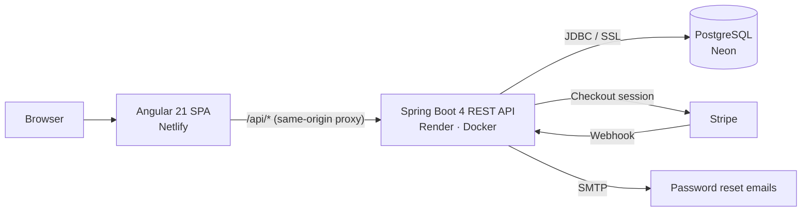
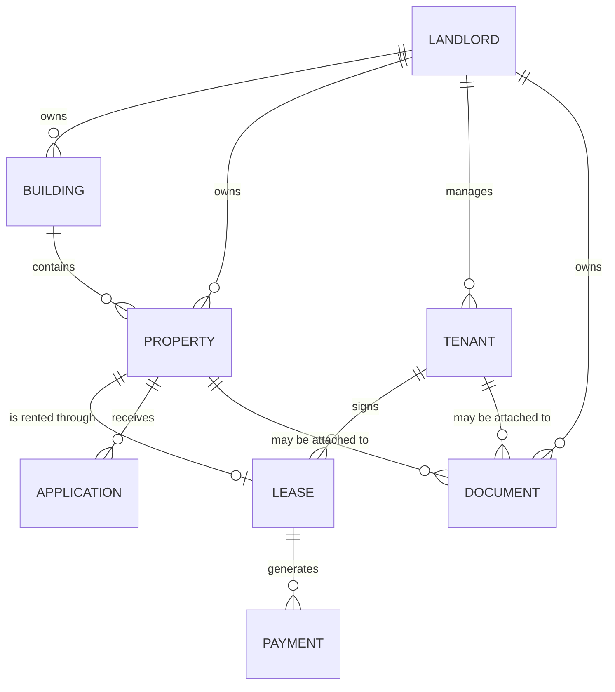

<div align="center">

# Nancy Immo

**A full-stack rental property management platform for landlords and tenants.**

Property portfolio, leases, online rent payments with Stripe, real PDF documents
(lease agreements & rent receipts), online applications, and strictly partitioned role-based workspaces.

<p>
  <a href="https://github.com/amadoudiop04/nancyImmolearning/actions/workflows/ci.yml"></a>
  
  
  
  
  
  
</p>

</div>

---

## Table of contents

- [Overview](#overview)
- [Features](#features)
- [Tech stack](#tech-stack)
- [Architecture](#architecture)
- [Data model](#data-model)
- [Getting started](#getting-started)
- [Demo accounts](#demo-accounts)
- [Configuration](#configuration)
- [API reference](#api-reference)
- [Interactive API documentation](#interactive-api-documentation)
- [Security](#security)
- [Testing and code quality](#testing-and-code-quality)
- [Continuous integration](#continuous-integration)
- [Deployment](#deployment)
- [Repository structure](#repository-structure)
- [Further documentation](#further-documentation)
- [Author](#author)

---

## Overview

Nancy Immo is a property management application built around two user profiles:

- **Landlords** manage their portfolio (buildings, properties, tenants, leases), collect rent,
  generate contractual documents, and process applications received online.
- **Tenants** get a personal workspace where they can view their property, their account statement
  and their documents, and pay rent by card — including catching up on overdue months.

Data isolation is strict: **each landlord only ever sees their own data**, and each tenant only
accesses their own lease. This separation is enforced server-side (Spring Security roles combined
with per-owner filtering in every service layer).

---

## Features

### Landlord workspace
- **Dashboard** with key indicators (properties, active tenants, monthly revenue, occupancy rate) and animated counters.
- **Property management**: create / edit / delete, attach to a building, photo (URL), publish for rent.
- **Tenant and lease management**, including a debit/credit account statement and a rolling 12-month payment history.
- **Payments**: tracking by status (paid / pending / late), aggregated statistics, online collection via Stripe.
- **Real PDF documents**: generation of **lease agreements** and **rent receipts** (bulk or individual), upload of supporting documents, download.
- **Applications**: inbox of online applications, filtering by status, accept / reject.
- **Account**: editable profile, notification preferences, account deletion (GDPR, full cascade).

### Tenant workspace
- Access to **their property**, **account statement** and **documents**.
- **Online rent payment** by card (Stripe Checkout), including **settlement of arrears** accumulated before the current month.

### Public (no account required)
- **Landing page** and **search for available properties** (budget / area / type filters).
- **Online rental application** for a property, without creating an account.

### Cross-cutting
- **JWT authentication** partitioned by role (landlord / tenant), plus **forgot password** with email reset.
- **Google Sign-In** (optional, server-side ID token verification).
- **Responsive design** (mobile → desktop), *toast* notifications, cookie consent banner (GDPR).

---

## Tech stack

| Layer | Technologies |
|-------|--------------|
| **Backend** | Spring Boot 4.0, Java 21, Spring Web MVC, Spring Data JPA / Hibernate, Spring Security, JWT (jjwt 0.12.6), Bean Validation |
| **Database** | PostgreSQL (schema managed by Hibernate `ddl-auto=update`) |
| **PDF** | OpenPDF 1.3.43 (`com.lowagie.text`) |
| **Payments** | Stripe Java 28.4.0 (Checkout + webhook) |
| **API docs** | springdoc-openapi 2.7.0 (Swagger UI + OpenAPI 3) |
| **Frontend** | Angular 21 (standalone components, `@if` / `@for` control flow), TypeScript 5.9, RxJS, Tailwind CSS 3.4 |
| **Testing / quality** | JUnit 5, Mockito, JaCoCo, Checkstyle (Google rules) · Karma + Jasmine, ESLint (angular-eslint) |
| **Build** | Maven (`mvnw` wrapper) · Angular CLI / npm |
| **Deployment** | Docker (backend) · Render · Netlify · Neon (PostgreSQL) |

---

## Architecture

The application is made of **three independently deployable pieces**:



- The **frontend** only talks to the backend through `/api/*`. In production a Netlify proxy relays
  those calls to the Render backend, so the browser only ever issues *same-origin* requests (no client-side CORS).
- The **backend** exposes a REST API secured by JWT tokens and enforces per-role data isolation.
- The **database** is a remote PostgreSQL instance (Neon) over SSL; the schema is generated on first start.

---

## Data model

The domain is built on **8 JPA entities**. Full mappings, foreign keys and cardinalities are documented
in [`backend/RELATIONS_ENTITES.md`](backend/RELATIONS_ENTITES.md).



- `Property` holds the foreign keys to `Building` and `Landlord`.
- `Tenant` holds the foreign key to `Landlord` (**per-landlord isolation**).
- `Lease` references `Property` (unique) and `Tenant`.
- `Payment` references `Lease`; `Application` references `Property`.
- `Document` references `Landlord`, and optionally `Property` and/or `Tenant`.

---

## Getting started

### Prerequisites

- **Java 21** (JDK)
- **Maven** — or the bundled wrapper (`mvnw.cmd` on Windows)
- **Node.js** (recent LTS) and **npm**
- **PostgreSQL** (a local database named `nancyImmo` by default)
- *(optional)* a **Stripe test key** (`sk_test_…`) to enable online payments

### 1. Database

Create a local PostgreSQL database (default name: `nancyImmo`):

```sql
CREATE DATABASE "nancyImmo";
```

### 2. Backend (port 8080)

```bash
cd backend
cp .env.example .env          # adjust DB credentials / JWT secret
mvn spring-boot:run           # Windows: mvnw.cmd spring-boot:run
```

On the first start against an empty database, a **demo dataset** is inserted automatically
(2 buildings, 6 properties, 3 tenants, leases, payments, applications…).

### 3. Frontend (port 4200)

```bash
cd frontend
npm install
npm start                     # ng serve, with an /api → http://localhost:8080 proxy
```

Then open **http://localhost:4200**.

---

## Demo accounts

Seeded automatically on a fresh database:

| Role | Username | Password |
|------|----------|----------|
| Landlord | `nancy@nancyimmo.fr` | `password123` |
| Tenant | `thomas.bernard@email.fr` | `password123` |

---

## Configuration

The backend reads its configuration from environment variables (a `backend/.env` file locally,
PaaS variables in production). See [`backend/.env.example`](backend/.env.example).

| Variable | Purpose | Default (local) |
|----------|---------|-----------------|
| `db_host` / `db_port` / `db_name` | Local PostgreSQL connection | `localhost` / `5432` / `nancyImmo` |
| `db_username` / `db_password` | PostgreSQL credentials | `postgres` / `root` |
| `SPRING_DATASOURCE_URL` / `_USERNAME` / `_PASSWORD` | Full datasource override (production / Neon) | — |
| `SECURITY_JWT_SECRET` | JWT signing secret (HS256) | *required* |
| `APP_CORS_ALLOWED_ORIGINS` | Allowed CORS origins, comma-separated | `http://localhost:4200` |
| `APP_FRONTEND_URL` | Frontend URL (Stripe redirects + password reset links) | `http://localhost:4200` |
| `MAIL_HOST` / `MAIL_PORT` | SMTP server (password reset emails) | `smtp.gmail.com` / `587` |
| `MAIL_USERNAME` / `MAIL_PASSWORD` | SMTP credentials (Gmail: *app password*) — empty disables sending (link is logged instead) | *(empty)* |
| `MAIL_FROM` | Displayed sender address | `MAIL_USERNAME` |
| `GOOGLE_CLIENT_ID` | Google OAuth 2.0 client ID — empty hides the Google button | *(empty)* |
| `STRIPE_SECRET_KEY` | Stripe secret key (`sk_test_…`) — otherwise payment endpoints return 503 | *(empty)* |
| `STRIPE_WEBHOOK_SECRET` | Stripe webhook secret (`whsec_…`), optional | *(empty)* |
| `PORT` | HTTP listening port (injected by the PaaS) | `8080` |

### Google Sign-In and password reset emails

Both features are **optional**: with no configuration the app remains fully usable — the Google
button is hidden, and the reset link is written to the backend logs instead of being emailed.

**Google Sign-In** — in the [Google Cloud console](https://console.cloud.google.com/apis/credentials),
create a *Web application* OAuth 2.0 client, add your origin (`http://localhost:4200` locally) under
**Authorized JavaScript origins**, then set `GOOGLE_CLIENT_ID`. A known email signs in with its existing
role. An unknown email creates an account of the **type chosen by the user**: on `/inscription` the
Landlord/Tenant selector also applies to the Google button, and on `/connexion` a modal asks for the
account type before creating it.

**Emails (Gmail)** — enable two-factor authentication on the Google account, generate an
[app password](https://myaccount.google.com/apppasswords), then set `MAIL_USERNAME` (your Gmail address)
and `MAIL_PASSWORD` (the 16-character app password). The reset link points to
`APP_FRONTEND_URL/reset?token=…` and is valid for 30 minutes.

> [!WARNING]
> Never commit a real `.env` file or any secret. Generate a strong JWT secret, e.g. `openssl rand -base64 48`.

---

## API reference

Base path: `/api`. All responses are JSON. Protected endpoints expect an
`Authorization: Bearer <JWT>` header.

### Authentication — `/api/auth` *(public except `/me`)*

| Method | Path | Description |
|--------|------|-------------|
| GET | `/config` | Public configuration (Google client ID) |
| POST | `/register` | Sign up (landlord or tenant role) |
| POST | `/login` | Sign in → returns a JWT |
| POST | `/google` | Google sign-in / sign-up (`{idToken, role?}` — ID token verified server-side; unknown email without `role` → 409 `requiresRole`) |
| POST | `/forgot-password` | Sends a password reset email (generic response) |
| POST | `/reset-password` | Reset via token + automatic login |
| GET | `/me` | Current user profile |
| DELETE | `/me` | Delete account (cascade) |

### Properties — `/api/properties`

| Method | Path | Access |
|--------|------|--------|
| GET | `/available` | **Public** — available properties (search) |
| GET · POST | `/` | Authenticated (landlord-scoped) |
| GET | `/details` · `/{id}` · `/{id}/details` | Authenticated |
| PUT · DELETE | `/{id}` | Authenticated |

### Tenants · Buildings · Landlords · Leases

| Resource | Endpoints |
|----------|-----------|
| `/api/tenants` | `GET` · `POST` · `GET/PUT/DELETE {id}` |
| `/api/buildings` | `GET` · `POST` · `GET/PUT/DELETE {id}` |
| `/api/landlords` | `GET` · `POST` · `GET/PUT/DELETE {id}` |
| `/api/leases` | `GET` · `POST` · `GET/PUT/DELETE {id}` · `GET {id}/statement` (account statement) |

### Payments — `/api/payments`

| Method | Path | Description |
|--------|------|-------------|
| GET · POST | `/` | List / create |
| GET | `/stats` | Totals by status |
| POST | `/checkout` · `/confirm` | Stripe payment (landlord) |
| GET | `/tenant/{id}/history` | Rolling 12-month history |
| GET · PUT · DELETE | `/{id}` | Detail / update / delete |

### Documents — `/api/documents`

| Method | Path | Description |
|--------|------|-------------|
| POST | `/generate-bail` | Generate a lease agreement (PDF) |
| POST | `/generate-quittances` · `/generate-quittance` | Generate rent receipts (bulk / single) |
| POST | `/upload` | Upload a supporting document (multipart) |
| GET | `/{id}/download` | Download the file |
| GET · DELETE | `/` · `/{id}` | List / detail / delete |

### Applications — `/api/applications`

| Method | Path | Access |
|--------|------|--------|
| POST | `/` | **Public** — submit an application |
| GET | `/` | Authenticated (landlord) |
| PUT | `/{id}/status` | Authenticated |
| DELETE | `/{id}` | Authenticated |

### Dashboard — `/api/dashboard`

| Method | Path | Access |
|--------|------|--------|
| GET | `/` | **Public** — global statistics |
| GET | `/me` | Authenticated — statistics for the current landlord |

### Tenant portal — `/api/portal` *(role `LOCATAIRE`)*

| Method | Path | Description |
|--------|------|-------------|
| GET | `/property` | Their property |
| GET | `/statement` · `/dues` | Account statement / outstanding months |
| GET | `/documents` · `/documents/{id}/download` | Their documents |
| POST | `/checkout` · `/confirm` | Online payment (tenant-scoped) |

### Misc

| Method | Path | Access |
|--------|------|--------|
| POST | `/api/stripe/webhook` | **Public** (signature-verified) — Stripe events |
| GET | `/` | **Public** — health check |

---

## Interactive API documentation

The backend ships with **springdoc-openapi**, so the whole API can be browsed and tried out from the browser
once the backend is running:

| Resource | URL |
|----------|-----|
| Swagger UI | <http://localhost:8080/swagger-ui.html> |
| OpenAPI 3 schema (JSON) | <http://localhost:8080/v3/api-docs> |

> [!NOTE]
> These two routes are declared `permitAll()` in `SecurityConfig` for convenience during development.
> Before going to production, disable them (`springdoc.api-docs.enabled=false`) or restrict them to an
> authenticated role, so the full API surface is not publicly exposed.

---

## Security

- **Stateless JWT authentication** (HS256, 24 h expiry); passwords hashed with **BCrypt**.
- **Two roles**: `BAILLEUR` (landlord) and `LOCATAIRE` (tenant). The tenant portal (`/api/portal/**`) is restricted to `LOCATAIRE`.
- **Data isolation**: every service filters by owner (the authenticated landlord); any `landlordId`
  sent by the client is ignored. A tenant can only reach data attached to their own leases.
- **CORS** restricted to the declared origins (`APP_CORS_ALLOWED_ORIGINS`).
- **Deliberately public endpoints**: landing / health check (`/`), authentication (`/api/auth/**`),
  available properties (`GET /api/properties/available`), global statistics (`GET /api/dashboard`),
  application submission (`POST /api/applications`), Stripe webhook (`POST /api/stripe/webhook`),
  and the API documentation routes listed above.

---

## Testing and code quality

### Backend

```bash
cd backend
mvn test                      # unit tests (JUnit 5 + Mockito)
mvn verify                    # tests + JaCoCo coverage report
mvn checkstyle:check          # Google code style report (non-blocking)
```

Current unit tests cover the JWT service (token issuance, claims, validation) and the tenant arrears
computation in `PortalService`. The JaCoCo HTML report is generated at
`backend/target/site/jacoco/index.html`.

### Frontend

```bash
cd frontend
npm test                      # Karma + Jasmine
npm run lint                  # ESLint (angular-eslint)
npm run build                 # production build
```

---

## Continuous integration

[`.github/workflows/ci.yml`](.github/workflows/ci.yml) runs on every pull request targeting `main` or `master`,
with two parallel jobs:

| Job | Steps |
|-----|-------|
| `backend` | JDK 21 (Temurin) + Maven cache → `mvn -B clean package` (build **and** tests) |
| `frontend` | Node 20 + npm cache → `npm ci` → `npm run build` |

---

## Deployment

The full (free and secure) deployment procedure is described step by step in **[`DEPLOYMENT.md`](DEPLOYMENT.md)**.

In short:

| Component | Host | Configuration |
|-----------|------|---------------|
| PostgreSQL database | **Neon** | JDBC SSL connection string |
| Spring Boot backend | **Render** (Docker) | [`render.yaml`](render.yaml) + [`backend/Dockerfile`](backend/Dockerfile) |
| Angular frontend | **Netlify** | [`netlify.toml`](netlify.toml) (`/api/*` proxy + SPA fallback) |

The backend image is a multi-stage Docker build (Maven → JRE 21) and listens on `$PORT`, as expected by most PaaS providers.

---

## Repository structure

```
nancy-SpringBoot/
├── backend/                     # Spring Boot API (Java 21, Maven)
│   ├── src/main/java/com/nancyimmo/bailleur/
│   │   ├── controllers/         # REST endpoints
│   │   ├── services/            # Business logic (per-landlord isolation, PDF, Stripe)
│   │   ├── repositories/        # Spring Data JPA
│   │   ├── models/              # JPA entities (8)
│   │   ├── dto/                 # Data transfer objects (incl. dto/auth)
│   │   ├── security/            # JWT, filters, Spring Security config, CurrentUser
│   │   └── config/              # DataSeeder (demo data), ownership backfill
│   ├── src/test/java/           # JUnit 5 unit tests
│   ├── Dockerfile               # Multi-stage build (Maven → JRE)
│   ├── RELATIONS_ENTITES.md     # Data model documentation
│   └── .env.example
├── frontend/                    # Angular 21 + Tailwind application
│   └── src/app/
│       ├── pages/               # accueil, auth, bailleur/*, locataire, recherche, profil
│       ├── services/            # api, auth, guards, interceptor, toast
│       ├── shared/              # toasts, cookie banner, Google sign-in button
│       └── layout/              # global header
├── .github/workflows/ci.yml     # CI pipeline (backend + frontend)
├── DEPLOYMENT.md                # Deployment guide (Neon + Render + Netlify)
├── render.yaml                  # Render blueprint (backend)
└── netlify.toml                 # Netlify configuration (frontend)
```

---

## Further documentation

- [`DEPLOYMENT.md`](DEPLOYMENT.md) — go-live guide (Neon + Render + Netlify) and security checklist.
- [`backend/RELATIONS_ENTITES.md`](backend/RELATIONS_ENTITES.md) — JPA relationships between entities.
- [`frontend/README.md`](frontend/README.md) — Angular CLI commands (serve, build, test).

---

## Author

**Amadou Diop** — [@amadoudiop04](https://github.com/amadoudiop04)